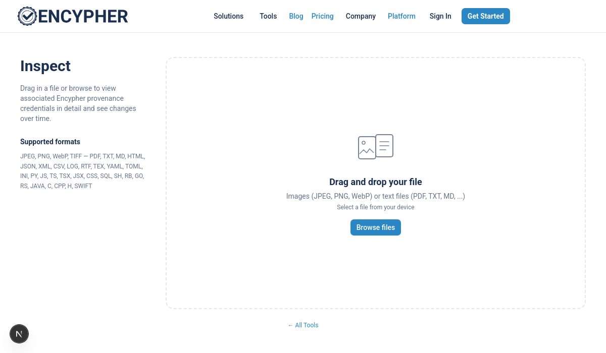
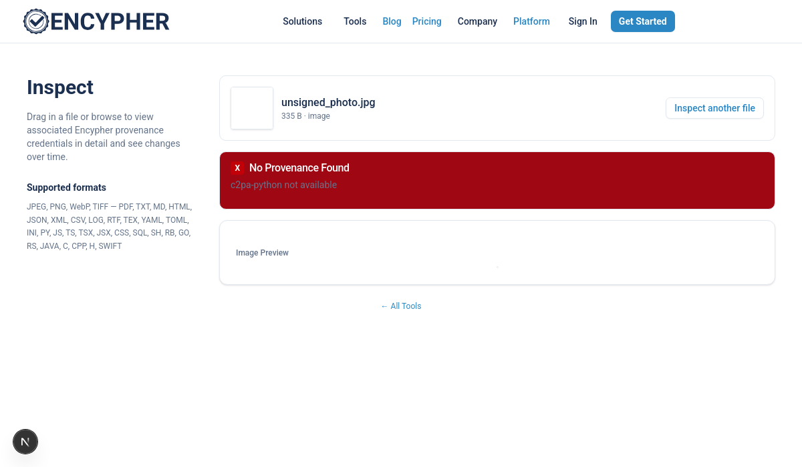
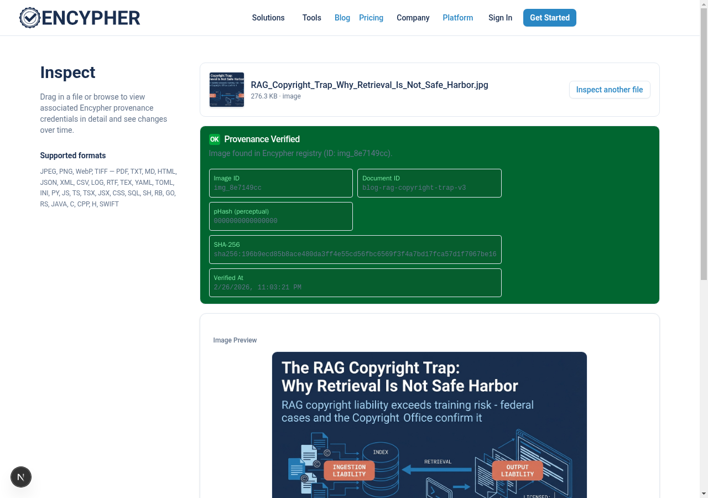

# Inspect Tool

Free public tool at `/tools/inspect`. Accepts images and text files via drag-and-drop
or browse. Submits them to the Encypher verify API and shows provenance status.

## Supported file types

| Type | Formats | Size limit |
|------|---------|-----------|
| Images | JPEG, PNG, WebP, TIFF | 10 MB |
| Text / code | PDF, TXT, MD, HTML, JSON, XML, CSV, PY, JS, TS, and 20+ others | 5 MB |

## Verification states (images)

**Provenance Verified** (green) -- image found in the Encypher registry via:
- C2PA JUMBF manifest validation, OR
- XMP `instance_id` database lookup (passthrough-mode images, CDN re-encodes)

Fields shown: Image ID, Document ID, SHA-256, Verified At timestamp.

**No Provenance Found** (red) -- image was not signed by Encypher, or the
signing record is not in this registry instance.

## Architecture

```
Browser
  --> FileInspectorTool.tsx
        isImageFile()  -> /api/tools/verify-image  (Next.js route)
        isTextFile()   -> /api/tools/verify         (Next.js route)
                                |
                                v
                    enterprise-api /api/v1/verify/image
                    (via Traefik verify-image-router, priority 110)
```

Key source files:

| File | Role |
|------|------|
| `src/components/tools/FileInspectorTool.tsx` | Main UI component |
| `src/lib/fileInspector.ts` | File type detection, size validation |
| `src/app/api/tools/verify-image/route.ts` | Next.js proxy -> enterprise verify/image |
| `src/lib/fileInspector.test.ts` | 44 unit tests |

## Screenshots




